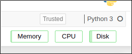

**[Installation](#installation)** |
**[Configuration](#configuration)** |
**[Resources Displayed](#resources-displayed)** |
**[Contributing](#contributing)**

# NBResuse

[](https://github.com/edina/nbresuse/issues)
[](https://travis-ci.org/edina/nbresuse)
[](https://dev.azure.com/tpaine154/jupyter/_build/latest?definitionId=17&branchName=master)
[](https://dev.azure.com/tpaine154/jupyter/_build?definitionId=17&_a=summary)

Docker NB Resource Usage (DNBResuse) is a fork of NBResuse.

Hereafter, it's called nbresuse



It is a small extension for Jupyter Notebooks running in a docker notebook, and
displays an indication of how much resources your current notebook server and
its children (kernels, terminals, etc) are using. This is displayed in the
main toolbar in the notebook itself, refreshing every 5s.

Reminder: This version is specific from notebooks running in docker containers.

Whilst running directly on a host, details can be pulled from pustil (which
pulls data from the `/proc` tree, however in a docker image the correct place
to pull this data is from the `/sys/fs/cgroup/`)

## Installation

You currently install this package by cloning from GitHub. In your dockerfile, add:

```bash
WORKDIR /srv
RUN git clone --depth 1 https://github.com/edina/nbresuse
# COPY . nbresuse
RUN pip install -e nbresuse
```
(swap the `RUN git ...` command for the `COPY . nbresuse` command when developing locally)

**If your notebook version is < 5.3**, you need to enable the extension manually.

```
jupyter serverextension enable --py nbresuse --sys-prefix
jupyter nbextension install --py nbresuse --sys-prefix
jupyter nbextension enable --py nbresuse --sys-prefix
```

## Configuration

### Memory Limit

`nbresuse` displays a memory usage against a maximum value. You can set this
in several ways:

1. `MEM_LIMIT` environment variable. This is set by [JupyterHub](https://github.com/jupyterhub/jupyterhub/)
   if using a spawner that supports it.
2. In the commandline when starting `jupyter notebook`, as `--ResourceUseDisplay.mem_limit=246579200`.
3. In your Jupyter notebook [traitlets](https://traitlets.readthedocs.io/en/stable/) config file:
 `c.NotebookApp.ResourceUseDisplay.mem_limit = 246579200`

The limit needs to be set as an integer in Bytes.

If unset, it reads the maximum memory available

### CPU Usage

`nbresuse` also displays CPU usage, reporting a `cpu_percent`.

You can set the `cpu_limit` in several ways:

1. `CPU_LIMIT` environment variable. This is set by [JupyterHub](https://github.com/jupyterhub/jupyterhub/)
   if using a spawner that supports it.
2. In the command line when starting `jupyter notebook`, as `--ResourceUseDisplay.cpu_limit=1.5`.
3. In your Jupyter notebook config file: `c.NotebookApp.ResourceUseDisplay.cpu_limit = 1.5`

The limit corresponds to the number of cpus the user has access to, but does not enforce it.

Reporting of this can be disabled:

1. In the command line when starting `jupyter notebook`, as `--ResourceUseDisplay.track_cpu_percent=False`.
2. In your Jupyter notebook config file: `c.NotebookApp.ResourceUseDisplay.track_cpu_percent=False`

### Disk Usage

`nbresuse` also displays Disk usage, reporting current & maximum values.

It uses `psutil` to determine values.

The `disk_maximum` is defined as the total byte size for the disk partition the directory is on, and that
directory defaults to `/home/joyan`, but can be defined (as outlined for `memory` and `cpu` above) using the
evironment variable `DISK_DIR` or the config variable `disk_dir` 

An artificial limit can be set as above, using either the `DISK_LIMIT` environment variable or the config
element `disk_limit`. This limit needs to be set as an integer in Bytes.

If `disk_limit` is unset, it reports `disk_maximum`

Reporting of this can be disabled:

1. In the command line when starting `jupyter notebook`, as `--ResourceUseDisplay.track_disk_usage=False`.
2. In your Jupyter notebook config file: `c.NotebookApp.ResourceUseDisplay.track_disk_usage=False`


## Resources Displayed

Out the box, all three metrics are displayed.

Items can me removed, see above.

Resources are displayed as a named box, with a bar to indicate a level of use.

The bar is green for normal use, turns orange at 75%, red at 90%, and goes maroon when over 100%


The bar is green for normal use, turns orange at 75%, red at 90%, and goes maroon when over 100%

If you wish to see the actual values, each box has a tool-tip that displays the numeric values at the
time the tool-tip is raised.

## Contributing

If you would like to contribute to the project, please read the [`CONTRIBUTING.md`](CONTRIBUTING.md). The `CONTRIBUTING.md` file
explains how to set up a development installation and how to run the test suite.
